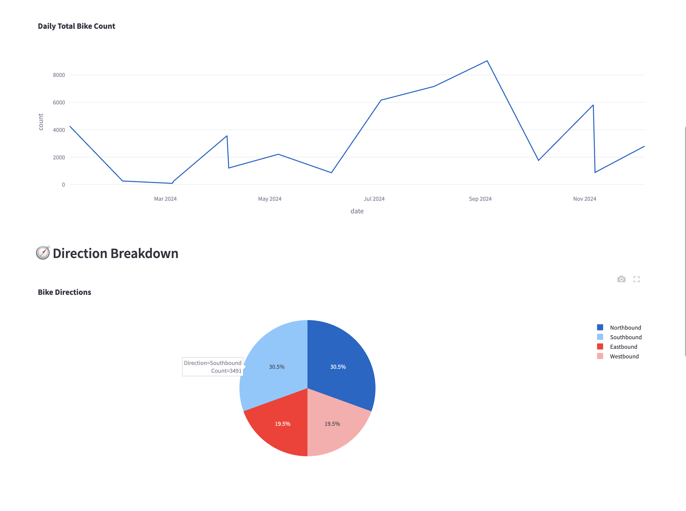

# 🚲 London Cycleways Dashboard

This is a simple but powerful dashboard built with **Streamlit** and **Plotly** to explore bike usage data in London.  
You can filter by location and date, and see different visualizations that help make sense of the numbers.

---

## 📦 What's Inside?

We take a bunch of CSV files (with cycle counts), clean them up, store them in a small **SQLite** database, and show everything on a web dashboard!

## 🚀 How to Run It

### 1. Install the tools

Make sure you have Python 3. Then open terminal and run:

```bash
pip install streamlit pandas plotly
````

### 2. Put your data in

Drop all the `.csv` files into the `raw_data/` folder.

### 3. Load data into the database

Run this script to clean and save everything into a local SQLite database:

```bash
python scripts/load_to_sqlite.py
```

It will create a file called `cycleways.db` in the `data/` folder.

### 4. Run the dashboard

Now launch the Streamlit app:

```bash
streamlit run scripts/main.py
```

It will open in your browser automatically 🎉

---

## 📊 What Can You See?

Here’s what the dashboard shows and what each chart does:

### 1. 📄 Filtered Data Preview

See a live table of the data based on your filters (location + date).

---

### 2. 📆 Daily Bike Count Over Time

**Line chart** that shows how bike usage changes day by day.
Great for spotting trends like peaks during weekdays or dips on rainy days.

```python
fig = px.line(daily, x="date", y="count", title="Daily Total Bike Count")
```

---

### 3. 🧭 Direction Breakdown

**Pie chart** showing how bikes are moving: inbound, outbound, or both.
Helps understand traffic flow.

```python
fig = px.pie(dir_data, names="Direction", values="Count")
```

---

### 4. 🚲 Bike Count by Mode

**Bar chart** showing how many bikes were private vs. rental.
(Useful for city planning or bike sharing analysis.)

```python
fig = px.bar(mode_counts, x="Mode", y="Total Bikes")
```

---

## 🧠 How It Works (in simple terms)

* We use **pandas** to read and clean the CSV files.
* We save the cleaned data into **SQLite** (a mini database stored as a file).
* Then we build interactive charts using **Plotly** inside a **Streamlit** app.
* You can pick locations and dates using the sidebar, and the charts update live!

---

## 📸 Preview



---

## 🧪 Want to Customize It?

* Want to add maps? Use `pydeck` or `folium`
* Want to deploy? Try [Streamlit Cloud](https://streamlit.io/cloud)
* Want to connect to real-time data? Add an API fetch in the ETL script

---

## ✨ Credits

Built with ❤️ by Albert
Just having fun with data and making dashboards more fun to explore!

```

---
